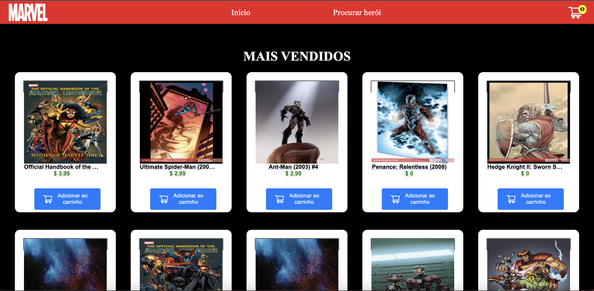
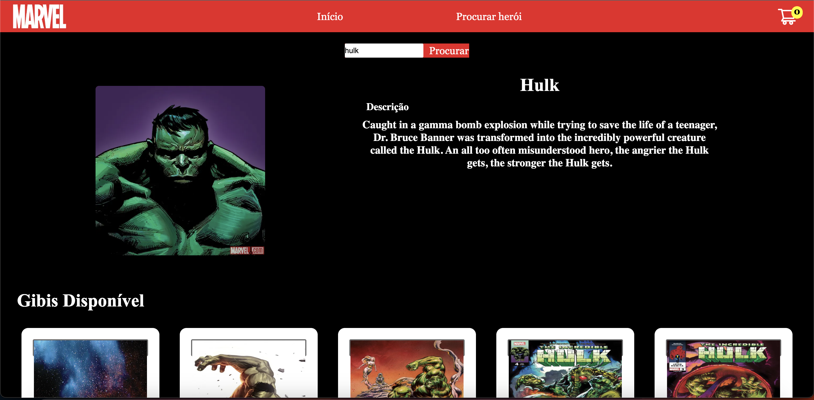
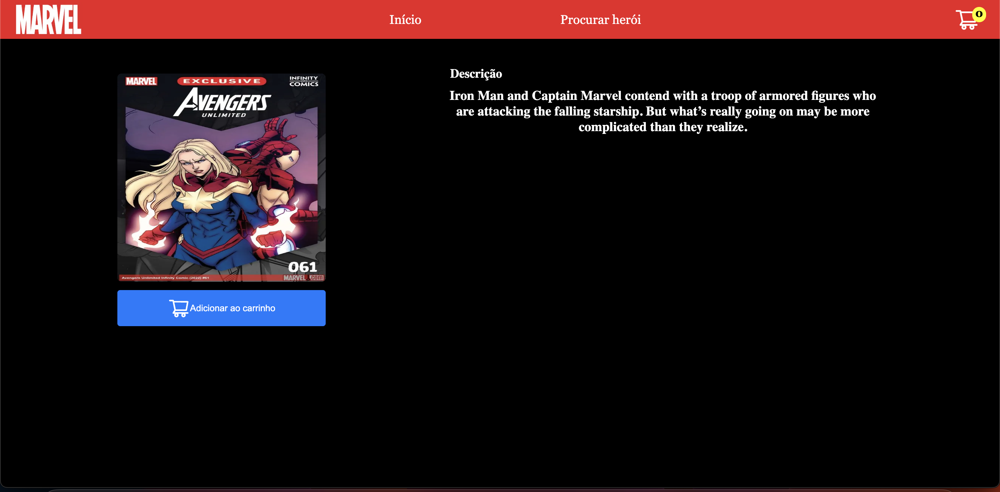
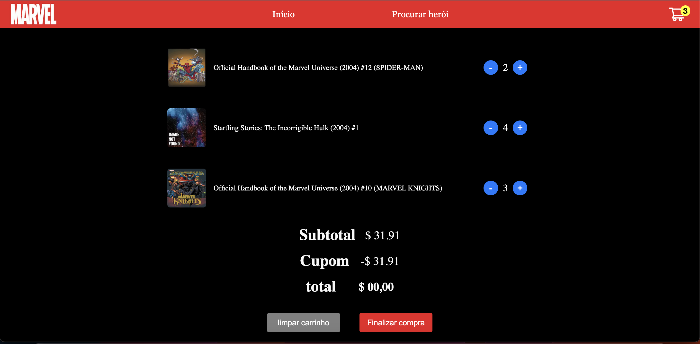

This is a [Next.js](https://nextjs.org/) project bootstrapped with [`create-next-app`](https://github.com/vercel/next.js/tree/canary/packages/create-next-app).

## Getting Started

First, install the dependencies:

```bash
yarn
```

and then run the development server:

```bash
yarn dev
```

Open [http://localhost:3000](http://localhost:3000) with your browser to see the result

# 🚀 Loja de Quadrinhos Marvel - Desenvolvimento Web 🌐


## Description

a react.js application that gets all the data from the marvel api: 'https://developer.marvel.com/'


<p align="center">
  <a rel="noopener" target="_blank"></a>
   <a rel="noopener" target="_blank"></a>
    <a rel="noopener" target="_blank"></a>
    <a rel="noopener" target="_blank"></a>
</p>


---
<p align="center">
  Conecte-se comigo no LinkedIn:
</p>
<p align="center">
  <a href="https://www.linkedin.com/in/lucas-almeida-5280b9206/" target="_blank">
    
  </a>
</p>
<p align="center">
  &copy; 2023 Lucas Almeida. Este projeto está sob a licença [MIT](LICENSE).
</p>

